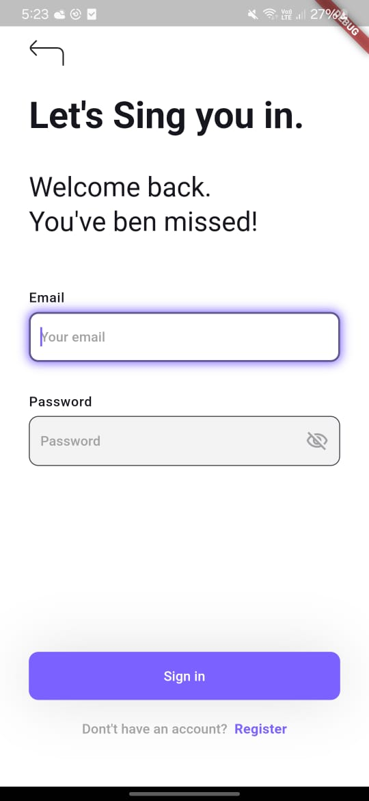

# AWT LTD task

A **A Flutter application demonstrating a **Login Screen** integrated with **Firebase Authentication**. This project utilizes **Cubit** for state management and follows the **MVVM (Model-View-ViewModel)** design pattern for clean architecture and scalability.

## 📸 Screenshots of the App

| **Screen**            |**Screenshot**                                    |
|------------------------|--------------------------------------------------|
| **Login Screen**        |      |

## Features

- Firebase Authentication
  - Email/Password Login
  - User validation with Firebase
- State Management using Cubit
- MVVM Design Pattern Implementation
- Responsive UI Design
- Error Handling and Validation

---
### Firebase Setup

1. Create a project in the [Firebase Console](https://console.firebase.google.com/).
2. Enable **Email/Password Authentication** in the Authentication section.
3. Download the `google-services.json` (for Android) and place them in their respective project folders.


### Layers

1. **Model**: Contains data structures and Firebase integration.
2. **View**: Widgets for the UI.
3. **ViewModel**: Implements business logic, state management using Cubit.

---

## Installation

### Clone the Repository
```bash
$ git clone https://github.com/NourNabil2/ATW-Task.git
$ cd flutter-firebase-login
```

### Install Dependencies
```bash
$ flutter pub get
```

### Run the App
```bash
$ flutter run
```

---

## Usage

1. Launch the app.
2. Enter your email and password use ( email: test@gmail.com pass: 123456).
3. Authenticate through Firebase.

---

## Folder Structure

```plaintext
├── lib/
│   ├── Core/
│   │   ├── Utils/
│   │   └── Widgets/
│   │
│   ├── Features/
│   │   ├── Auth_page/
│   │   │   ├── model/
│   │   │   │   └── login_model.dart
│   │   │   ├── Model_View/
│   │   │   │   └── auth_cubit.dart
│   │   │   │   └── auth_state.dart
│   │   │   └── View/
│   │   │       └── login_screen.dart
│   │   │
│   └── main.dart
```

- **`Core`**: Common utilities and widgets.
- **`Features/Auth_Screen`**: Handles authentication-related logic and UI.
- 

## Acknowledgements

- [Firebase](https://firebase.google.com/) for backend services.
- [Flutter Bloc](https://bloclibrary.dev/) for state management.
- MVVM Design Pattern for clean architecture inspiration.

